# Gyógynövénykereső weboldal és webáruház

## Tartalomjegyzék
- [Bevezetés](#bevezetés)
- [Felhasználói útmutató](#felhasználói-útmutató)
  - [Technikai követelmények](#technikai-követelmények)
  - [Az oldal elérése](#az-oldal-elérése)
  - [Regisztráció és bejelentkezés](#regisztráció-és-bejelentkezés)
  - [Keresőfunkció használata](#keresőfunkció-használata)
  - [Blog használata](#blog-használata)
  - [Webshop használata](#webshop-használata)
  - [Információs oldalak](#információs-oldalak)
  - [Kosár és vásárlás](#kosár-és-vásárlás)
  - [Rendelés kezelése](#rendelés-kezelése)
  - [Profil kezelése](#profil-kezelése)
- [Adminisztrátori útmutató](#adminisztrátori-útmutató)
  - [Belépés a vezérlőpultra](#belépés-a-vezérlőpultra)
  - [Blogbejegyzések kezelése](#blogbejegyzések-kezelése)
  - [Kategóriák kezelése](#kategóriák-kezelése)
  - [Termékek kezelése](#termékek-kezelése)
  - [Rendelések kezelése](#rendelések-kezelése)
  - [Szállítási módok kezelése](#szállítási-módok-kezelése)
  - [Fizetési módok kezelése](#fizetési-módok-kezelése)
  - [Felhasználók kezelése](#felhasználók-kezelése)
  - [Kapcsolati üzenetek kezelése](#kapcsolati-üzenetek-kezelése)
  - [Feliratkozások kezelése](#feliratkozások-kezelése)
  - [Termékstatisztikák](#termékstatisztikák)

## Bevezetés

A Gyógynövénykereső egy innovatív online platform, amely a természetes alapú egészségmegőrzést és életmódot támogatja egy különleges keresőfunkcióval. Az oldal segítségével a felhasználók betegségek vagy gyógynövények alapján kereshetnek információkat, és részletes leírásokat találhatnak a különböző gyógynövények tulajdonságairól, hatásairól és felhasználási módjairól.

A keresőhöz szorosan kapcsolódik egy webáruház, amely a találatokhoz igazított, releváns étrend-kiegészítőket, gyógyhatású termékeket és egyéb természetes megoldásokat kínál. Ez a kombinált rendszer megkönnyíti a felhasználók számára a számukra megfelelő termékek azonosítását és beszerzését.

Az oldalon a vásárlási folyamat átlátható és felhasználóbarát. A termékek böngészésekor a vásárlók megtekinthetik az árakat, mennyiségeket, készletinformációkat és kedvezményeket. A kosárba helyezett termékek után azonnal látható a részösszeg, a szállítási költség és a végösszeg. Az oldal emellett tájékoztat arról, mennyit kell még vásárolni az ingyenes szállítás eléréséhez.

A rendelés során a felhasználók megadhatják számlázási és szállítási adataikat, valamint kiválaszthatják a szállítási módot (például postai kézbesítést vagy expressz szállítást) és a fizetési lehetőséget (kártyás fizetés, utánvét stb.).

A Gyógynövénykereső célja, hogy egy átfogó, intuitív és hatékony platformot biztosítson, amely egyszerre segíti az információkeresést, a közösségi együttműködést és a termékbeszerzést. Az oldal ösztönzi a természetes alapú megoldások felfedezését, és olyan vásárlási élményt kínál, amely egyesíti a tudás, a közösségi támogatás és a praktikum előnyeit.

## Felhasználói útmutató

### Technikai követelmények

Az oldal használatához internetkapcsolattal rendelkező eszköz szükséges, például:

- Számítógép (pl. Windows operációs rendszerrel)
- Laptop
- Okostelefon (Android vagy iOS operációs rendszerrel)
- Tablet

A Gyógynövénykereső böngészőalapú, tehát nincs szükség külön letöltésre vagy telepítésre. A népszerű böngészők (Chrome, Firefox, Safari stb.) bármelyikével működik.

### Az oldal elérése

1. Nyisd meg az internetes böngészőt a választott eszközödön.
2. Írd be az oldal URL-címét: [www.gyogynovenyaruhaz.hu](http://www.gyogynovenyaruhaz.hu), majd nyomd meg az Enter gombot.

### Regisztráció és bejelentkezés

#### Regisztráció:
- Kattints a **Regisztráció** menüpontra.

- Add meg a nevedet, email címedet és jelszavadat.

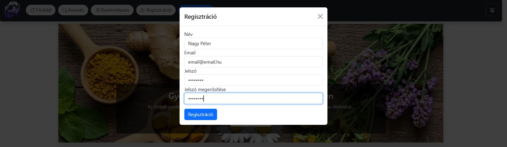

- További adataidat megadhatod bejelentkezés után a **Profilom** menüpont alatt.

#### Belépés:
- Kattints a **Belépés** menüpontra.

- Add meg az e-mail címedet és jelszavadat.

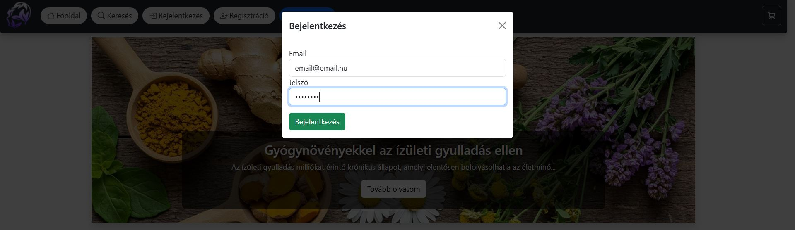

### Keresőfunkció használata

- Kattints a Keresés gombra a felső menüben.

#### Keresés betegségek alapján:
- Megadhatsz betegségeket vesszővel elválasztva (pl. megfázás, fejfájás, köhögés), hogy olyan gyógynövényeket találj, amelyek segíthetnek ezek kezelésében.

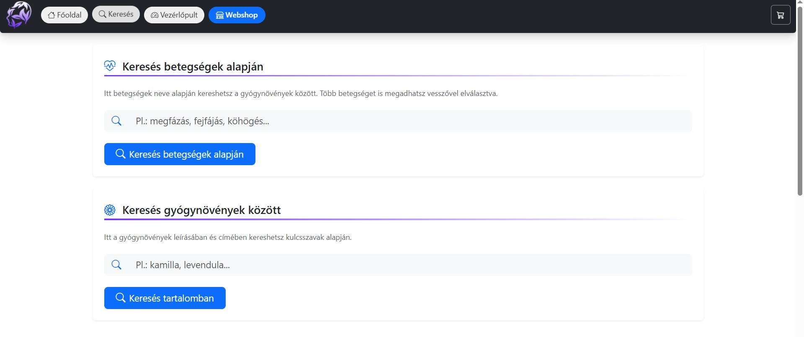

#### Keresés gyógynövények között:
- Kulcsszavak alapján kereshetsz a gyógynövények leírásában és címében (pl. kamilla, levendula).
- Ha nincs találat a keresési feltételekre, a rendszer jelzi ezt.

#### Hírlevél feliratkozás:
- Feliratkozhatsz hírlevelünkre, ahol megadhatod az e-mail címedet, és elfogadhatod az adatvédelmi nyilatkozatot.
- Tippeket, akciókat és újdonságokat kaphatsz közvetlenül a postaládádba.

### Blog használata

#### Legfrissebb bejegyzések:
- A főoldalon a legújabb blogbejegyzések jelennek meg.

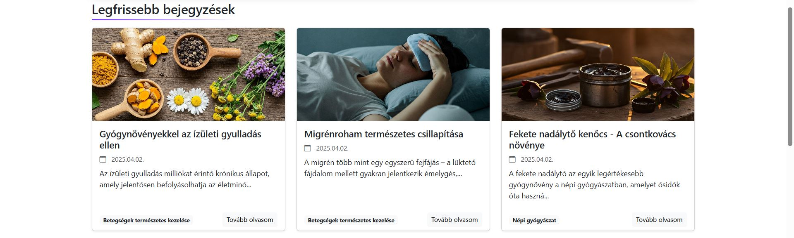

#### Kategóriák:
- Böngészhetsz a bejegyzések különböző kategóriái között.

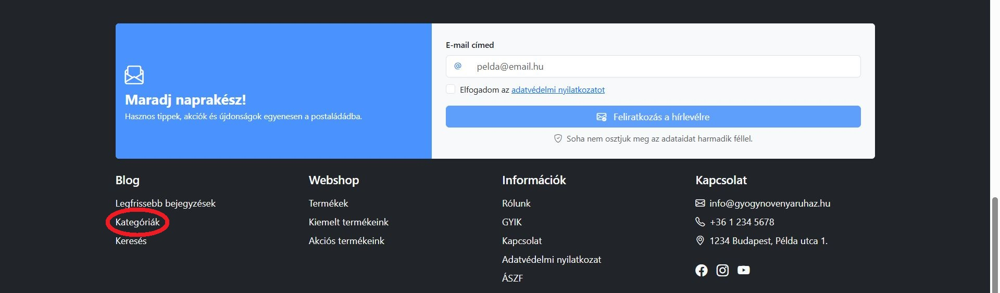

### Webshop használata

#### Főoldal:
- Az összes elérhető terméket megtalálhatod itt.

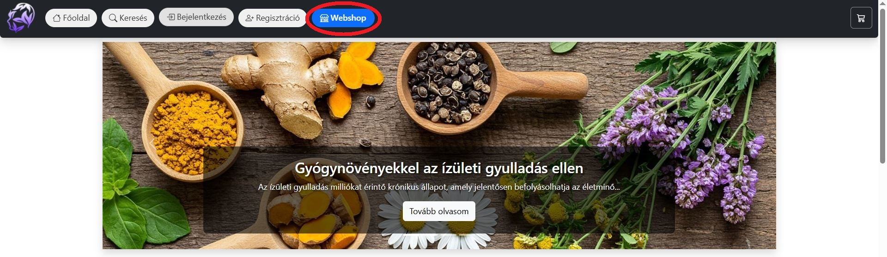

#### Akciók:
- Kiemelt ajánlatainkat és kedvezményes termékeinket a Webshop legfelső részén találod, lapozható formában.

#### Kiemelt termékek:
- Ebben a mezőben az általunk kiemelt termékeket találod, amelyekről nem érdemes lemaradni.

#### Keresés és szűrés:
- Kereshetsz kulcsszavak alapján
- Rendezheted a termékeket újdonságuk szerint
- Rendezheted ár vagy név szerint
- Szűrhetsz termékkategóriák szerint

#### Webshop lábléc linkek
- A Termékek linkre kattintva a Webshop főoldalára jutsz
- A Kiemelt termékeink linkre kattintva, a kiemelt termékek listáját láthatod
- Az Akciós termékeink linkre kattintva, az akciós termékek listáját láthatod

### Kosár és vásárlás

#### Termékek hozzáadása:
- A kosárba helyezett termékek, például C-vitamin, megjelennek árukkal és mennyiségükkel.
- Az összesítés tartalmazza a részösszeget, szállítási költséget és végösszeget.

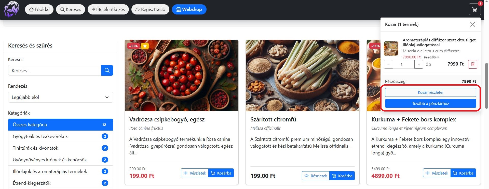

#### Szállítási és fizetési információk:
- **Szállítási mód:** pl. Postai kézbesítés – költsége 1500 Ft.
- **Fizetési mód:** pl. Kártyás fizetés.
- **Végösszeg:** Az oldal kiszámolja a fizetendő összeget, például 6800 Ft.

### Rendelés kezelése

#### Adatok megadása:
- Számlázási és szállítási adatok kitöltése (piros csillaggal jelölt mezők kötelezőek).
- Példa: Teszt Tamás, 1234 Budapest, Példa utca 123.

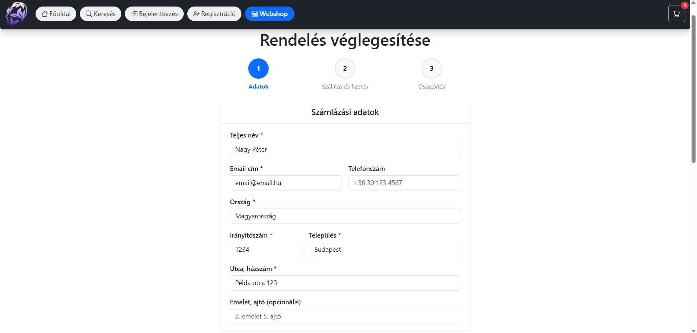

#### Szállítási és fizetési opciók kiválasztása:
- Szállítási mód (pl. Postai kézbesítés).
- Fizetési mód (pl. Kártyás fizetés).

#### Rendelés véglegesítése:
- Ellenőrizd az összesített rendelési adatokat.
- Fogadd el az Általános Szerződési Feltételeket és Adatvédelmi Szabályzatot.

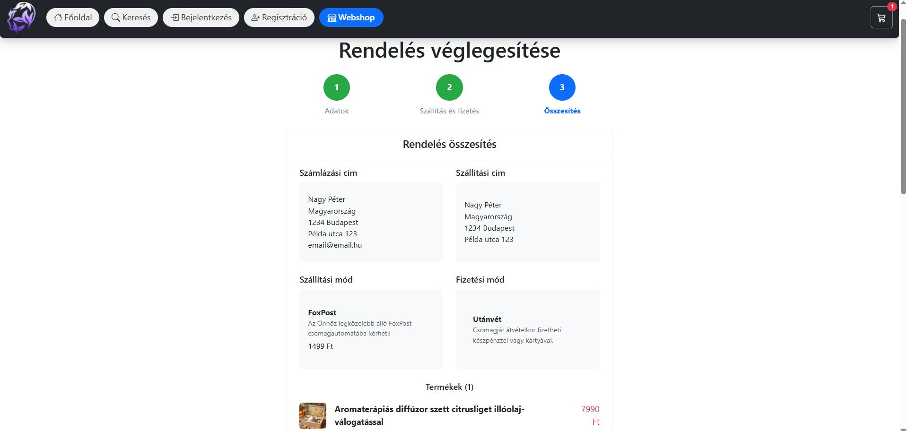

#### Rendeléseim:
- A leadott rendeléseket listázza a rendelési azonosítóval, dátummal, összeggel és státusszal.
- Példa: ORD-20250323205913-PFWK1K, 6800 Ft, Új rendelés.

### Profil kezelése

#### Profil frissítése:
- Új jelszó megadása és megerősítése.
- Személyes adatok, például cím és elérhetőség módosítása.

### Információs oldalak

#### Rólunk:
- Olvasd el az oldal történetét, célját, és információkat a működéséről.

#### GYIK:
- Gyakran ismételt kérdések és válaszok segítenek a leggyakoribb problémák megoldásában.

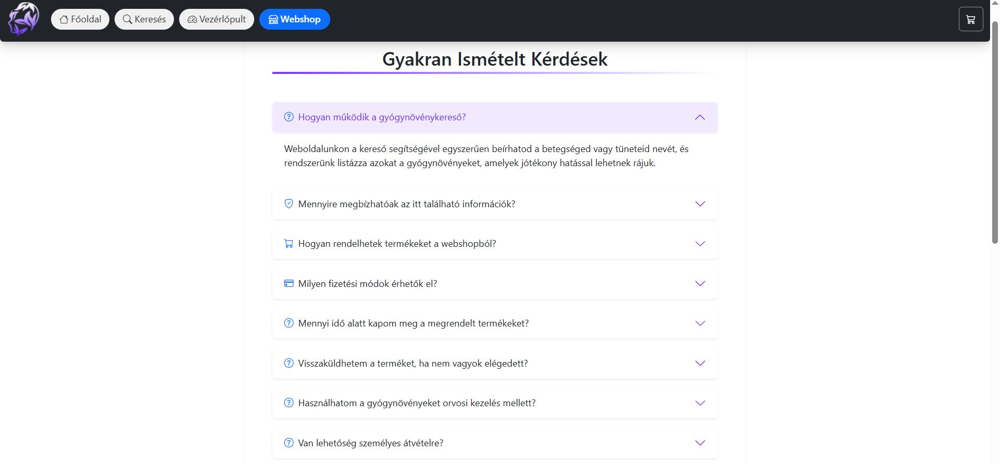

#### Kapcsolat:
- Add meg a neved, e-mail címed, a megkeresés tárgyát, és írd le az üzenetedet.

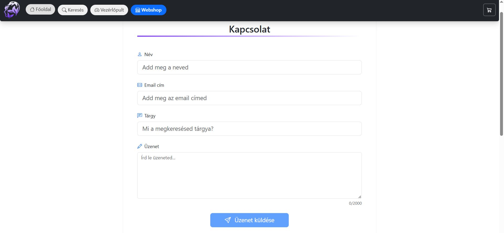

#### Adatvédelmi nyilatkozat:
- Részletek az adatkezelésről, melyet feliratkozáskor elfogadhatsz.

#### ÁSZF:
- Az Általános Szerződési Feltételek elérhetők itt.

## Adminisztrátori útmutató

### Belépés a vezérlőpultra

- Kattints a **Belépés** menüpontra, és lépj be az admin e-mail címeddel és jelszavaddal.
- Sikeres bejelentkezés után elérhetővé válik a **Vezérlőpult**, ahol a weboldal és a webshop működtetésével kapcsolatos funkciókat találod.

### Blogbejegyzések kezelése

#### Új bejegyzés létrehozása:
1. **Cím megadása:** Adj meg egy címet, amely röviden összefoglalja a tartalom lényegét.
2. **Kategória kiválasztása:** Válassz megfelelő kategóriát, hogy a bejegyzés könnyen megtalálható legyen.
3. **Bejegyzés állapotának beállítása:** Választhatsz például "Vázlat" lehetőséget.
4. **Kép feltöltése:** Tölts fel egy képet (max. 2MB), amely illusztrálja a bejegyzés tartalmát.
5. **Tartalom megadása:** Írd be a bejegyzés szöveges tartalmát.
6. **Betegségek listázása:** Sorold fel az érintett betegségeket vesszővel elválasztva (pl. cukorbetegség, magas vérnyomás, asztma).
7. **Kiemelés:** Jelöld ki a bejegyzést kiemeltként, ha azt szeretnéd.

### Kategóriák kezelése

#### Kategória létrehozása:
- Írd be a kategória nevét az erre kijelölt mezőbe, majd kattints a megfelelő gombra a létrehozáshoz.

#### Kategóriák megtekintése és kezelése:
- A már meglévő kategóriák listája a táblázatban jelenik meg.
- Minden kategória neve mellett megtalálható a törlés gomb.

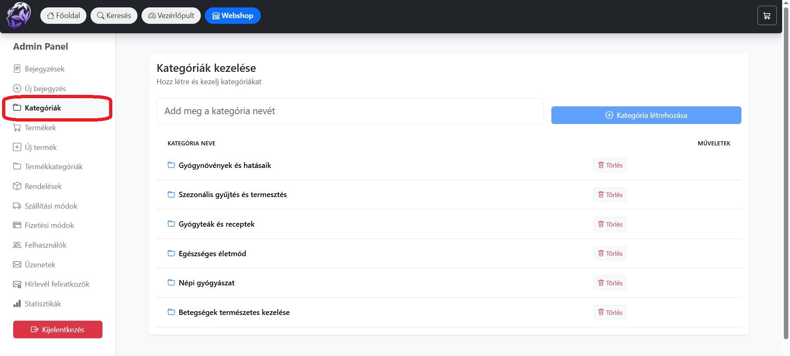

### Termékek kezelése

#### Termékek áttekintése:
- A termékek táblázatos formában jelennek meg a következő adatokkal:
  - Kép
  - ID
  - Név
  - Latin név
  - Ár
  - Készlet
  - Kategória
  - Státusz
  - Kiemelt
  - Műveletek (megtekintés, szerkesztés, törlés)

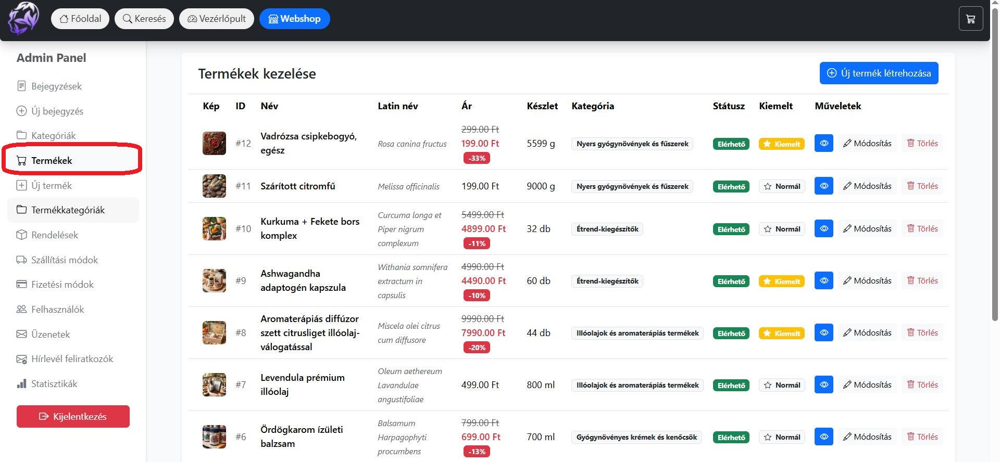

#### Új termék létrehozása:
1. Kattints az "Új termék létrehozása" gombra.
2. Töltsd ki az alábbi mezőket:
   - **Termék neve:** Add meg a termék nevét.
   - **Latin név (opcionális):** Írd be a növény latin nevét.
   - **Kategória:** Válassz a meglévő kategóriák közül.
   - **Ár (Ft):** Add meg a termék árát.
   - **Akciós ár (opcionális):** Ha van kedvezményes ár, azt itt adhatod meg.
   - **Elérhetőség:** Válaszd ki, hogy a termék elérhető-e.
   - **Kiemelt termék:** Jelöld meg, ha kiemeltként szeretnéd megjeleníteni.
   - **Készlet mennyiség:** Add meg a rendelkezésre álló mennyiséget.
   - **Mértékegység:** Válaszd ki a megfelelő mértékegységet (pl. gramm).
   - **Termék leírása:** Írd be a termék részletes ismertetését.
   - **Felhasználási javaslat:** Adj meg javaslatokat a termék használatára.
   - **Termék képei:** Tölts fel képeket (max. 2MB/kép).

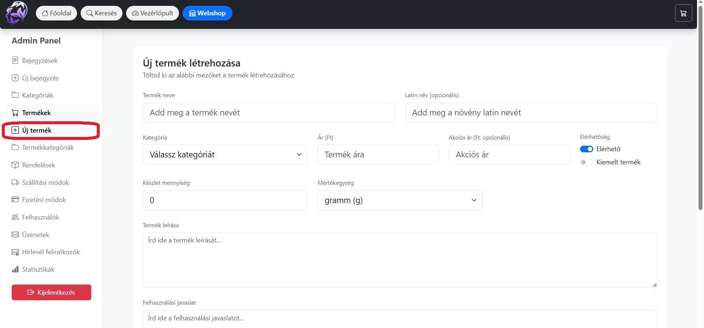

#### Termék képek feltöltése:
- A képeket egyszerűen áthúzhatod a feltöltési területre, vagy kattinthatsz, hogy manuálisan válassz fájlokat.

### Termékkategóriák kezelése

#### Új kategória létrehozása:
1. Navigálj a **Termékkategóriák** menüpontra.
2. Add meg a kategória nevét az erre kijelölt mezőben.
3. (Opcionális) Töltsd ki a kategóriához tartozó leírást.
4. Kattints a **Mentés** gombra a kategória létrehozásához.

#### Kategóriák áttekintése:
- A létrehozott kategóriák táblázatos formában jelennek meg:
  - Kategória neve
  - Leírás
  - Műveletek (törlés)

### Rendelések kezelése

#### Rendelések áttekintése:
- A rendeléseket táblázatos formában láthatod a következő adatokkal:
  - Rendelés # (egyedi rendelésazonosító)
  - Dátum (a rendelés dátuma és időpontja)
  - Vásárló (a rendelést leadó személy neve)
  - Összeg (a rendelés teljes értéke Ft-ban)
  - Státusz (a rendelés aktuális státusza, pl. Új rendelés)
  - Műveletek (szerkesztés, törlés, státusz módosítása, megjegyzés)

#### Státusz szűrő:
- A státusz szűrővel az adatbázisban lévő rendeléseket különböző státuszok alapján szűrheted.

#### Rendelés részleteinek megtekintése:
- Ellenőrizd a vásárló adatait és a rendelés részleteit.
- A táblázatban található **Műveletek** segítségével végezhetsz módosításokat:
  - A rendelés státuszának frissítése
  - A rendelés adatainak szerkesztése
  - A rendelés törlése, ha szükséges

#### Rendelés információk:
- **Rendelés azonosító:** Az egyedi rendelésazonosító (pl. ORD-20250323205913-PFWK1K)
- **Rendelés dátuma:** A rendelés leadásának időpontja (pl. 2025. 03. 23. 21:59)
- **Rendelés státusza:** Az aktuális státusz (pl. Új rendelés)
- **Fizetés módja:** A kiválasztott fizetési forma (pl. Kártyás)
- **Szállítás módja:** Az alkalmazott kézbesítési lehetőség (pl. Postai kézbesítés)

#### Státusz módosítása:
- Válassz ki egy új státuszt (pl. Feldolgozás alatt, Szállítás alatt) az opciók közül.
- (Opcionális) Írj megjegyzést a változtatáshoz.

#### Vásárló adatok megtekintése:
- **Számlázási adatok/Szállítási adatok:**
  - Név
  - Cím
  - E-mail
  - Telefonszám

#### Státusz előzmények:
- Az előzményekben megtekinthető, mikor és hogyan változott a rendelés státusza.

#### Rendelési tételek:
- A termékek listája tartalmazza:
  - Termék neve
  - Egységár
  - Mennyiség
  - Összesen
  - Részösszeg
  - Szállítási költség
  - Végösszeg

### Szállítási módok kezelése

#### Szállítási módok áttekintése:
- Az összes szállítási mód egy táblázatban jelenik meg:
  - # (azonosító sorszám)
  - Név (a szállítási mód megnevezése)
  - Leírás (a szállítási mód rövid ismertetése)
  - Költség (a szállítás díja Ft-ban)
  - Szállítási idő (a kézbesítés várható ideje munkanapokban)
  - Állapot (aktív vagy inaktív)
  - Műveletek (szerkesztés és törlés)

#### Új szállítási mód létrehozása:
1. Kattints az **Új szállítási mód** gombra.
2. Töltsd ki az alábbi mezőket:
   - **Név:** Add meg a szállítási mód nevét (pl. Futárszolgálat, Személyes átvétel).
   - **Költség (Ft):** Írd be a szállítás költségét. Ha díjmentes, írd be 0-t.
   - **Szállítási idő (munkanap):** Add meg a szállítás várható idejét munkanapokban.
   - **Állapot:** Állítsd be az állapotot Aktívra, ha a szállítási mód használatra kész.
   - **Leírás (opcionális):** Írj egy rövid ismertetőt a szállítási módról.
3. Kattints a **Mentés** gombra az új szállítási mód hozzáadásához.

#### Szállítási módok szerkesztése vagy törlése:
- A már meglévő szállítási módok módosítására és törlésére a táblázat **Műveletek** oszlopában elérhető opciókat használhatod.

### Fizetési módok kezelése

#### Fizetési módok áttekintése:
- Az összes elérhető fizetési mód táblázatos formában jelenik meg:
  - # (azonosító sorszám)
  - Név (a fizetési mód neve)
  - Leírás (rövid ismertető a fizetési módról)
  - Sorrend (az a sorrend, amelyben a fizetési módok megjelennek)
  - Állapot (aktív vagy inaktív)
  - Műveletek (szerkesztés és törlés)

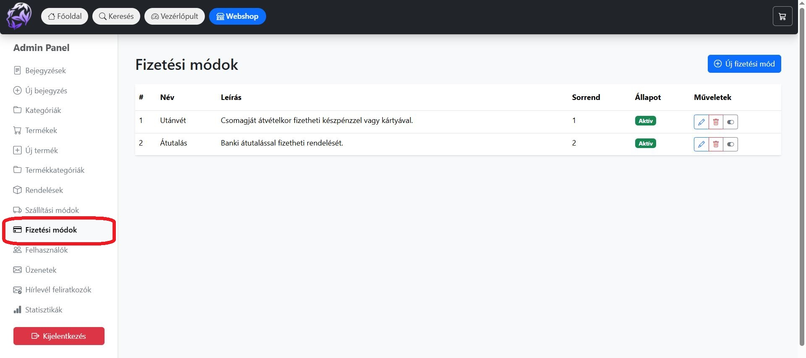

#### Új fizetési mód létrehozása:
1. Kattints az **Új fizetési mód** gombra.
2. Töltsd ki az alábbi mezőket:
   - **Név:** Add meg a fizetési mód nevét (pl. Banki átutalás, Utánvét).
   - **Sorrend:** Írd be a fizetési mód sorrendjét a megjelenéshez. A kisebb számú érték előrébb kerül.
   - **Állapot:** Állítsd be Aktívra, ha használható fizetési módról van szó.
   - **Leírás (opcionális):** Adj egy rövid leírást a fizetési módról.
3. Kattints a **Mentés** gombra a fizetési mód hozzáadásához.

#### Fizetési módok szerkesztése vagy törlése:
- A táblázatban található **Műveletek** oszlop segítségével módosíthatod vagy törölheted a meglévő fizetési módokat.

### Felhasználók kezelése

#### Felhasználók áttekintése:
- A felhasználók listája táblázatos formában jelenik meg:
  - Név (a felhasználó neve)
  - Email (a felhasználó regisztrációhoz használt e-mail címe)
  - Regisztráció (a regisztráció időpontja)
  - Cím (a felhasználóhoz társított cím, ha megadott)
  - Jogosultság (a felhasználó jogosultsági szintje, pl. Admin)

#### Szuper Admin lehetőségei:
- Felhasználó kezelése: A rendszerben elérhető funkciókkal a felhasználók szerkesztése, admin jog kiosztása/elvétele vagy felhasználó törlése lehetséges.

### Kapcsolati üzenetek kezelése

#### Üzenetek áttekintése:
- Az üzenetek táblázatos formában jelennek meg:
  - Név (az üzenetküldő neve)
  - Email (az üzenetküldő e-mail címe)
  - Tárgy (az üzenet tárgya)
  - Üzenet (az elküldött üzenet rövid tartalma)
  - Dátum (az üzenet érkezési dátuma és időpontja)
  - Státusz (az üzenet feldolgozottsági állapota)
  - Műveletek (lehetőség az üzenetek kezelésére, például olvasottnak jelölés vagy törlés)

### Feliratkozások kezelése

#### Feliratkozások áttekintése:
- A feliratkozások táblázatos formában jelennek meg:
  - Email (a feliratkozó e-mail címe)
  - Felhasználó (a feliratkozó típusa, pl. Vendég feliratkozó)
  - Státusz (az aktuális állapot, pl. Aktív vagy Inaktív)
  - Feliratkozás ideje (a feliratkozás dátuma és időpontja)
  - Leiratkozás ideje (ha a feliratkozó leiratkozott, itt jelenik meg az időpont; ellenkező esetben "N/A")
  - Műveletek (lehetővé teszi a feliratkozások módosítását vagy törlését)

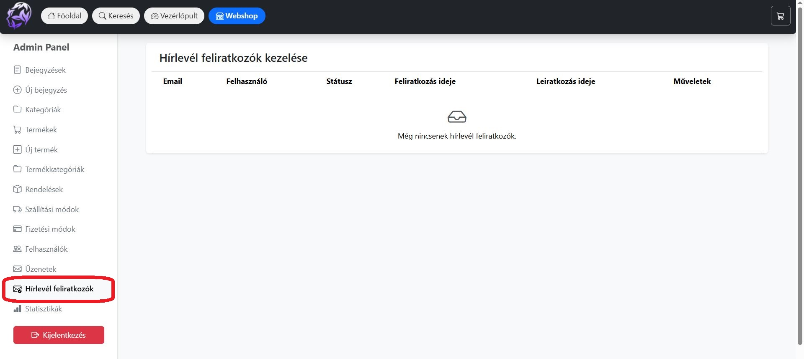

### Termékstatisztikák

#### Statisztikai adatok áttekintése:
- A statisztikák segítségével nyomon követheted a termékek teljesítményét:
  - Összes megtekintés (az oldalon belüli összes termékmegtekintés száma)
  - Összes eladás (az összes eladott termék mennyisége)

#### Legnépszerűbb termékek:
- **Legtöbbet nézett:** Az a termék, amelyet a legtöbbször tekintettek meg
- **Legtöbbet eladott:** Az a termék, amelyből a legtöbbet vásárolták

#### Top termékek:
- **Top termékek megtekintés szerint:** Azok a termékek, amelyek a legtöbb látogatást kapták
- **Top termékek eladás szerint:** Azok a termékek, amelyekből a legnagyobb mennyiség került eladásra
